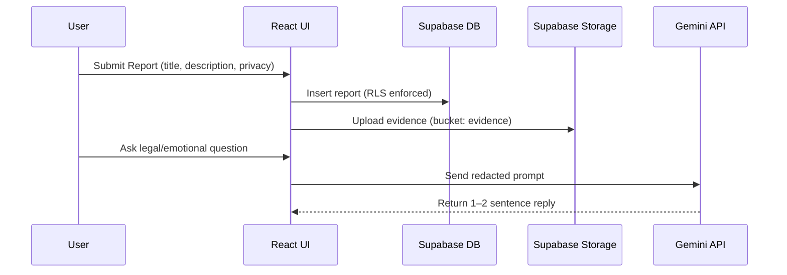

<div align="center">

# Rakshak

AI-Assisted Legal & Emotional Support Platform for Students

<br/>


</div>

Rakshak provides safe, confidential legal and emotional support with secure reporting, evidence management, and AI-assisted guidance. It is designed for student, teacher, and root-admin roles with privacy-first architecture.

## Highlights

- 🛡️ **Secure Reporting**: Anonymous or identified submissions with RLS protections
- 🔒 **Privacy First**: Row-Level Security, PII redaction, scoped policies
- 🤖 **AI Chat**: Legal and emotional assistants with concise (1–2 sentence) replies
- 👥 **Role-Based Dashboards**: Student, Teacher, and Root views
- 📅 **Appointments**: Schedule and manage counseling sessions
- 📁 **Evidence Storage**: Supabase Storage bucket `evidence` per-report

## Visual Overview

```mermaid
flowchart LR
   A[User (Student/Teacher/Root)] --> B[React Router Pages]
   B --> C[DashboardLayout]
   C --> D[Supabase Auth]
   C --> E[Supabase DB (RLS)]
   C --> F[Supabase Storage (evidence)]
   B --> G[Gemini API]
   G -->|concise reply| B
```



## Tech Stack

- **Frontend**: React 18, TypeScript, Vite, TailwindCSS
- **Backend**: Supabase (Auth, Postgres, Storage)
- **Routing**: React Router v6
- **AI**: Google Gemini 2.0 Flash (concise responses)
- **Testing**: Vitest (unit), Playwright (e2e)

## Prerequisites

- Node.js 18+
- npm
- Supabase project and keys

## Environment Variables

Create `.env.local` in the project root:

```env
VITE_SUPABASE_URL=your_supabase_url
VITE_SUPABASE_ANON_KEY=your_supabase_anon_key
VITE_GEMINI_API_KEY=your_gemini_api_key
# Optional: shorten replies further
VITE_GEMINI_MAX_TOKENS=128
```

## Quickstart

```bash
# Clone the repository
git clone https://github.com/Saurav-Astro/Rakshak.git
cd Rakshak

# Install dependencies
npm install

# Run setup checks (optional)
npm run setup:check

# Start dev server
npm run dev

# Build production bundle
npm run build

# Preview build
npm run preview
```

## Database & Storage Setup

1. Create a Supabase project.
2. In the SQL editor, run migrations in order:
    - `supabase/migrations/00_init.sql`
    - `supabase/migrations/01_enable_rls.sql`
    - `supabase/migrations/02_seed_data.sql`
    - Any `003_*` trigger fixes as needed
3. Create a storage bucket named `evidence`.
4. Apply storage policies from `supabase/01_storage_policies.sql` if present.

## Roles & Permissions

- **Student**: create reports, upload evidence, view own reports, chat
- **Teacher**: view/triage reports, manage statuses, appointments
- **Root**: admin tools, user management, audits, data tasks

Row-Level Security (RLS) ensures each role only accesses permitted data. See `supabase/migrations/*` for exact policies.

## App Structure

```txt
src/
   pages/                # Route pages per role
   components/           # UI components
   hooks/                # useAuth, useReports, etc.
   lib/                  # supabaseClient, gemini, utils
   App.tsx               # Router & protected routes
```

Key pages:
- `pages/StudentDashboard.tsx` / `pages/dashboard/*`
- `pages/NewReport.tsx` (submit)
- `pages/ReportDetail.tsx` (view)
- `pages/Chat.tsx` (AI support)
- `components/ui/dashboard-with-collapsible-sidebar.tsx` (layout)

## Data Model (Simplified)

- `profiles`: id, role, display_name, phone, org, class, emergency_contacts
- `reports`: id, reporter_id, is_anonymous, title, description, status, priority, category, created_at
- `evidence`: id, report_id, storage_path, file_type, file_size, uploaded_by, encrypted
- `appointments`: id, user_id, teacher_id, start_time, end_time, status
- `bot_messages`: id, user_id, message_type, content, created_at

## AI Chat Behavior (Concise)

- Replies are capped to 1–2 sentences (≈300 chars).
- PII is redacted before sending to Gemini (`redactPII`).
- Lightweight response cache avoids duplicate API calls for repeated inputs within 5 minutes.

## Security & Privacy

- ✅ Row-Level Security (RLS) on all tables
- ✅ Evidence stored under `evidence` bucket path `reports/<id>/...`
- ✅ PII redaction for emails, phones, PAN, Aadhaar
- ✅ Role-based routing and access checks in UI

## Testing

- Unit: `npm test`
- E2E: `npm run test:e2e` (Playwright)
- Test setup: `tests/setup.ts`

## Scripts

- `npm run dev` — Vite dev server
- `npm run build` — TypeScript + Vite build
- `npm run preview` — Serve built app
- `npm run test` — Vitest
- `npm run test:e2e` — Playwright
- `npm run setup:check` — Environment checks

## Deployment

Deploy any static hosting (Netlify/Vercel/Nginx). Configure `.env` with Supabase and Gemini keys. Ensure storage bucket and policies exist.

## Roadmap

- Evidence encryption at rest (client-side optional)
- Teacher assignment workflows and notifications
- Accessibility enhancements & localization
- CI pipeline for build + e2e checks

## Disclaimer

Rakshak provides general legal information and emotional support. It does not replace professional legal counsel or medical advice. For emergencies in India: Police (100), Women Helpline (1091), AASRA (9820466726), iCall (9152987821).


Rakshak is a comprehensive web application providing safe, confidential legal and emotional support for students, with secure reporting, evidence management, and AI-assisted guidance.

## Features

- 🛡️ **Secure Reporting**: Anonymous or identified report submission with encryption
- 🔒 **Privacy First**: Row-level security, encrypted evidence storage
- 🤖 **AI Assistants**: Emotional and legal support chatbots
- 👥 **Role-Based Access**: Student, Teacher, and Root admin roles
- 📊 **Dashboards**: Tailored interfaces for each user role
- 📅 **Appointments**: Schedule counseling sessions
- 📁 **Evidence Management**: Secure file upload with optional client-side encryption

## Tech Stack

- **Frontend**: React 18, TypeScript, Vite, TailwindCSS
- **Backend**: Supabase (Auth, Database, Storage, Edge Functions)
- **Database**: PostgreSQL with Row-Level Security
- **Routing**: React Router v6
- **Testing**: Vitest, Playwright

## Prerequisites

- Node.js 18+ 
- npm or yarn
- Supabase account

## Environment Variables

Create a `.env` file in the root directory:

```env
VITE_SUPABASE_URL=your_supabase_url
VITE_SUPABASE_ANON_KEY=your_supabase_anon_key
```

## Installation

```bash
# Clone the repository
git clone <repository-url>
cd Rakshak

# Install dependencies
npm install

# Start development server
npm run dev
```

## Database Setup

1. Create a new Supabase project
2. Run the migrations in order:
   ```bash
   # In Supabase SQL Editor, run:
   # 1. supabase/migrations/00_init.sql
   # 2. supabase/migrations/01_enable_rls.sql
   # 3. supabase/migrations/02_seed_data.sql
   # 4. supabase/storage.sql
   ```

3. Create the storage bucket `evidence` in Supabase Storage

## User Roles

### Root (Admin)
- Full system access
- User management
- Audit logs access
- Data export and management

### Teacher
- View and manage student reports in their class
- Triage and assign reports
- Schedule appointments
- View class analytics

### Student
- Submit reports (anonymous or identified)
- Upload evidence
- Chat with AI assistants
- View own report status
- Book appointments

## Project Structure

